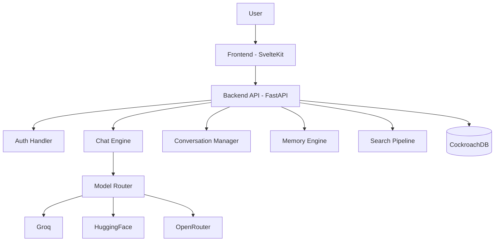

 `README.md`**

### (Logo + Badges + Mermaid + ASCII Diagrams + API Docs + Deployment + CI/CD + FAQ + EVERYTHING)

Copy–paste directly into your GitHub repo.

---

---

# <p align="center"></p>

# <p align="center"><b>✨ GenZ AI — Fast. Smart. Calm on Your Eyes. ✨</b></p>

### <p align="center">Proudly Made in Kashmir 🇮🇳</p>

---

# <p align="center">Developed by <b>Aaqib</b></p>

---

# 📛 Badges

<p align="center">
  
  
  
  
  
  
  
  
</p>

---

# 📝 Overview

GenZ AI is a modern, multi-model AI assistant inspired by:

* **ChatGPT** — smooth UX
* **Perplexity AI** — search + citations
* **DeepSeek** — reasoning mode
* **Calm Kashmiri winter UI**

Designed to be:

✔ Fast
✔ Smart
✔ Beautiful
✔ Multi-model
✔ Search-capable
✔ Mobile-friendly
✔ Eye-safe

---

# ❄️ UI Philosophy (Kashmiri Snow Theme)

* Soft frosted glass
* Light snow falling
* Smooth gradients
* No harsh whites/blacks
* Chinar leaf drift animations
* Clean typography (Sora + Inter)
* Relaxed, peaceful visual energy

---

# 🏛 Architecture

```
Frontend (SvelteKit)
   ↓
Backend API (FastAPI)
   ↓
Model Router (Groq/HF/OpenRouter/Search)
   ↓
Database (CockroachDB Serverless)
```

---

# 🔷 Mermaid Architecture Diagram



---

# 🔶 ASCII Diagram

```
      ┌─────────────────────────────┐
      │        Frontend UI          │
      │        (SvelteKit)          │
      └──────────────┬──────────────┘
                     │
                     ▼
      ┌─────────────────────────────┐
      │      FastAPI Backend        │
      │  - Auth                     │
      │  - Chat Engine              │
      │  - Conversation Manager     │
      │  - Memory System            │
      └──────────────┬──────────────┘
                     │
          ┌──────────┼───────────┐
          ▼          ▼           ▼
 ┌────────────┐  ┌────────┐  ┌─────────────┐
 │  Model API │  │ Search │  │ CockroachDB │
 │ Groq/HF/OR │  │ Engine │  │ Serverless  │
 └────────────┘  └────────┘  └─────────────┘
```

---

# ⚙️ Tech Stack

### **Frontend**

* SvelteKit
* TailwindCSS
* Sora + Inter fonts

### **Backend**

* FastAPI
* SQLAlchemy
* Pydantic
* Groq API
* HuggingFace API
* OpenRouter API

### **Database**

* CockroachDB Serverless

---

# 📁 Project Structure

```
GenZ_AI/
├── backend/
│   ├── main.py
│   ├── config.py
│   ├── database.py
│   ├── routes/
│   ├── services/
│   ├── models/
│   ├── utils/
│   └── requirements.txt
│
└── frontend/
    ├── src/
    ├── lib/
    ├── routes/
    ├── components/
    ├── app.css
```

---

# 🗄 Database Schema

### `users`

* id
* email
* username
* password
* role
* created_at

### `conversations`

* id
* user_id
* title

### `messages`

* id
* conversation_id
* role
* content
* model

### `memory`

* id
* user_id
* value

---

# 🔌 Installation

### Backend

```
cd backend
pip install -r requirements.txt
uvicorn main:app --reload
```

### Frontend

```
cd frontend
npm install
npm run dev
```

---

# 🔐 Environment Variables

Create `.env`:

```
DATABASE_URL=
JWT_SECRET=
GROQ_API_KEY=
HF_API_KEY=
OPENROUTER_API_KEY=
SEARCH_API_KEY=
```

---

# 📡 API Overview

### Auth

* POST `/auth/register`
* POST `/auth/login`

### Conversation

* GET `/conversations`
* POST `/conversations/new`
* PATCH `/conversations/rename`

### Chat

* POST `/chat`
* GET `/messages/{id}`

### Search

* POST `/search`

---

# 🤖 Model Routing

| Prefix | Provider      |
| ------ | ------------- |
| `g:`   | Groq          |
| `hf:`  | HuggingFace   |
| `or:`  | OpenRouter    |
| `web:` | Search Engine |

---

# 🔍 Search Pipeline

1. Query → Google/Serper
2. Scrape top pages
3. Summaries sent to LLM
4. Response + citations returned

---

# 🧩 Client SDK

### JavaScript Example

```js
import { createChat } from "./genz.js";

const client = createChat("YOUR_API_KEY");

const reply = await client.send("Hello GenZ AI!");

console.log(reply);
```

---

# 🚀 Deployment Guide

### Backend (Render.com)

* New Web Service
* Python 3.10
* Start Command:

```
uvicorn main:app --host 0.0.0.0 --port 10000
```

### Frontend (Vercel)

* Import SvelteKit project
* Build command: `npm run build`

### Database

* CockroachDB Serverless
* Regional cluster recommended

---

# 🔄 CI/CD (GitHub Actions)

```yaml
name: Deploy

on:
  push:
    branches: [ main ]

jobs:
  deploy:
    runs-on: ubuntu-latest
    steps:
    - uses: actions/checkout@v3
    - name: Install Python
      uses: actions/setup-python@v3
      with:
        python-version: 3.10
    - name: Install backend deps
      run: pip install -r backend/requirements.txt
```

---

# ❓ FAQ

### **Is GenZ AI free?**

Yes — backend is fully open-source.

### **Which models are supported?**

Groq, HuggingFace, OpenRouter, Search.

### **Is conversation memory stored?**

Yes — CockroachDB + custom memory engine.

---

# 👨‍💻 Developer

**Developed by:**

# ⭐ **Aaqib**

Proudly from Kashmir 🇮🇳

---

# 📄 License

MIT License.

---

# 🎉 DONE


